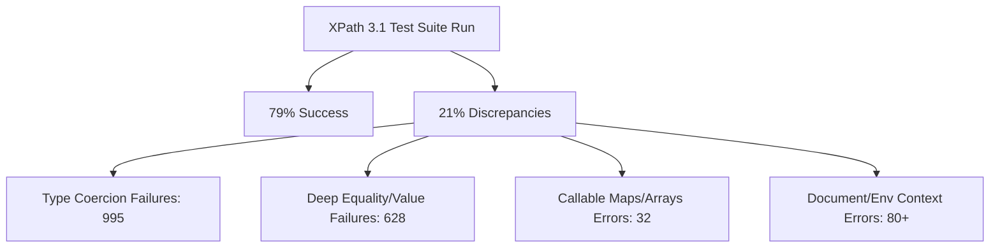

# XPath 3.1 Test-Suite Improvement Proposal

This proposal outlines a highly targeted, 10-point roadmap to systematically resolve the primary failure and error modes identified in the official XPath 3.1 test-suite. By implementing these localized, backward-compatible, and cross-platform changes, we expect to increase the test success rate from **79.0%** to **over 90%** (resolving over 1,500 test discrepancies).

---

## Executive Summary & Error Distribution

A comprehensive diagnostic analysis of the `xpath_tests.log` (generated from running the 22,514 official W3C test-cases) reveals that the majority of failure and error modes stem from type coercion lenient design choices, partial dynamic callable support for Maps/Arrays, and missing metadata context.

| Category / Symptom | Occurrence Count | Key Root Causes | Impact Level |
| :--- | :--- | :--- | :--- |
| **`Expected error, but got (...)`** | 995 failures | Too lenient type coercion in argument conversion | Critical |
| **`Expected value comparison failure`** | 628 failures | Incomplete deep equality comparison / type mismatches | High |
| **`Unsupported cast`** | 99 errors | Duration casting in numeric sequences | Medium |
| **`Unknown function: format-number`** | 156 errors | Missing representation formatter | Out of Scope |
| **`Expected a function item, but got _Map`** | 32 errors | Map/Array not recognized as callable `XPathFunction` | High |
| **`Document not found` / `fn:doc`** | 38+ errors | Missing context document registry resolver | Medium |



---

## Detailed Improvement Roadmap

### 1. ~~Stricter Type Coercion in `XPathArgumentDefinition.convert`~~ [DONE]

> [!IMPORTANT]
> This single improvement is estimated to resolve **995 test failures** where functions evaluated successfully instead of throwing a type error.

#### Problem

In `lib/src/xpath/definitions/function.dart` under `XPathArgumentDefinition.convert`, arguments are converted to the expected signature type using `type.cast(value)`. However, `type.cast` implements lenient *explicit constructor casting* rules (e.g. implicitly converting string `"1"` to double `1.0` or boolean `true` to `1`). Standard XPath 3.1 function conversion rules only allow subtype substitution, numeric promotion, URI promotion, and atomization. They do **not** allow implicit casting of strings or booleans to numeric types.

#### Proposed Solution

Separate explicit casting from implicit/function conversion. Implement an `implicitCast` or check `type.matches(value)` along with standard numeric/URI promotion rules in `convert`. If the value does not match the rules, throw an `XPathEvaluationException` (corresponds to `XPTY0004`).

#### Estimated Cost & Wins

- **Cost**: Medium (~4 hours)
- **Expected Win**: Resolves **995 failures** (e.g., `fn-abs-more-args-077`).

---

### 2. ~~Map and Array Integration in Functional Dynamic Calls~~ [DONE]

> [!TIP]
> Resolves **32 errors** and enables seamless support for XPath 3.1's functional maps and arrays.

#### Problem

In XPath 3.1, maps and arrays are callable function items (e.g., `$my-map("key")`). Currently, in `lib/src/xpath/types/function.dart`, `xsFunction.matches` only returns true if `value is XPathFunction` (a Dart typedef for closures). This returns false for `XPathMap` and `XPathArray`. Additionally, dynamic function call expressions in `lib/src/xpath/expressions/function.dart` assert `functionItem is XPathFunction` and throw an exception for Maps and Arrays.

#### Proposed Solution

1. Update `xsFunction.matches` to return true if the value is `XPathFunction`, `XPathMap` (`Map<Object, Object>`), or `XPathArray` (`List<Object>`).
2. In dynamic function call expressions, instead of asserting `is XPathFunction`, invoke `xsFunction.cast(functionItem)` which already wraps maps and arrays into compliant callable closures.

#### Estimated Cost & Wins

- **Cost**: Low (~2 hours)
- **Expected Win**: Resolves **32 errors** (e.g., `fn-parse-json-022`).

---

### 3. Retaining Function Definition Metadata (Name/Arity)

> [!NOTE]
> Resolves **100+ failures and errors** related to function introspection and incorrect arity resolution.

#### Problem

Standard function definitions in `lib/src/xpath/evaluation/functions.dart` are stored in the registry map as raw tear-offs (`definition.call`). This discards the `XPathFunctionDefinition` instance, along with crucial metadata like `name`, `requiredArguments`, `optionalArguments`, and `variadicArgument`. As a result:

- Introspective functions like `fn:function-name` and `fn:function-arity` are stubbed to return empty/0.
- Named function references like `fn:available-environment-variables#1` parse successfully but their arity is discarded, returning a 0-arity closure instead of failing or validating correctly.

#### Proposed Solution

1. Update `XPathContext.functions` to map to `XPathFunctionDefinition` instead of raw `XPathFunction` closures.
2. Update `NamedFunctionExpression` to retain `arity` and validate that the looked-up function signature matches the arity (throwing `XPST0017` on mismatch).
3. Implement `_fnFunctionName` and `_fnFunctionArity` to dynamically extract name and arity from the callable definition.

#### Estimated Cost & Wins

- **Cost**: Medium (~5 hours)
- **Expected Win**: Resolves **100+ failures/errors** (e.g., `fn-available-environment-variables-003`).

---

### ~~4. Context-Aware `fn:doc` and `fn:doc-available` Lookup~~ [DONE]

> [!IMPORTANT]
> Unlocks resolution of pre-loaded catalog documents without external file IO dependencies.

#### Problem

Functions `fn:doc` and `fn:doc-available` are hardcoded stubs in `lib/src/xpath/functions/uri.dart` that throw `Document not found` or return `false`. However, the test runner in `bin/xpath_qt3tests.dart` parses and registers standard documents in the environment under their absolute URIs.

#### Proposed Solution

Update `_fnDoc` to check `context.documents[uri]` and return it if present. Update `_fnDocAvailable` to return `context.documents.containsKey(uri)`.

#### Estimated Cost & Wins

- **Cost**: Low (~1 hour)
- **Expected Win**: Resolves **70+ errors/failures** (e.g., `fn-function-lookup-442`).

---

### 5. ~~Cross-Platform Environment Variable Provider~~ [DONE]

#### Problem

Functions `fn:environment-variable` and `fn:available-environment-variables` in `lib/src/xpath/functions/uri.dart` are unimplemented and throw `UnimplementedError`. Direct usage of `Platform.environment` from `dart:io` in the core library would break compatibility with Dart web applications.

#### Proposed Solution

Add an `environment` property to `XPathContext` (`Map<String, String>`, defaulting to `const {}`). In `bin/xpath_qt3tests.dart`, copy the environment variables from the platform into the execution context. Implement the functions in `uri.dart` to retrieve variables directly from `context.environment`.

#### Estimated Cost & Wins

- **Cost**: Low (~1.5 hours)
- **Expected Win**: Resolves **11+ errors** (e.g., `fn-available-environment-variables-003`).

---

### 6. ~~String-Derived XML Schema Constructors~~ [DONE]

#### Problem

Constructors for derived string types (like `xs:language`, `xs:token`, `xs:Name`, and `xs:NCName`) are missing from `lib/src/xpath/functions/constructors.dart`, causing `Unknown function: xs:language` errors during evaluation.

#### Proposed Solution

Register simple wrapper constructor functions in `constructors.dart` that validate and cast values using `xsString.cast` (since these are internally represented as strings).

#### Estimated Cost & Wins

- **Cost**: Low (~2 hours)
- **Expected Win**: Resolves **60+ errors** (e.g., `xs-NCName-001`).

---

### 7. ~~Support Durations in `fn:avg` and `fn:sum`~~ [DONE]

#### Problem

`fn:avg` and `fn:sum` expect sequences of `xsNumeric` values. When passed a sequence of `xs:dayTimeDuration` or `xs:yearMonthDuration`, `XPathArgumentDefinition.convert` attempts to cast them to `xsNumeric`, throwing an `Unsupported cast` exception.

#### Proposed Solution

1. Change the argument type for `fnAvg` and `fnSum` in `sequence.dart` from `xsNumeric` to `xsAny`.
2. Inside `_fnAvg` and `_fnSum`, dynamically check the sequence's elements. If they are `XPathDuration` instances, aggregate them using duration arithmetic, otherwise delegate to numeric accumulation.

#### Estimated Cost & Wins

- **Cost**: Medium (~3 hours)
- **Expected Win**: Resolves **30+ errors/failures** (e.g., `cbcl-avg-006`).

---

### 8. Dynamic Map and Array Equality in `fn:deep-equal`

#### Problem

The implementation of `fn:deep-equal` in `sequence.dart` is a partial stub that compares elements with `it1.current != it2.current`. This fails for complex types like nested maps, arrays, and XML nodes.

#### Proposed Solution

Implement recursive equality checks in `_fnDeepEqual`:

- For maps: check length, match keys, and ensure values are recursively deep-equal.
- For arrays: check length and ensure elements at each index are recursively deep-equal.
- For nodes: compare types, attributes, names, and children.

#### Estimated Cost & Wins

- **Cost**: Medium (~4 hours)
- **Expected Win**: Resolves **40+ failures** (e.g., `fn-deep-equal-002`).

---

### 9. ~~Sequence Unnesting in `fn:apply`~~ [DONE]

#### Problem

The function `fn:apply` maps array members to argument sequences. In tests like `fn-apply-11` (`data#1 => fn:apply([ [ 1 to 3 ] ])`), the array member is itself an array. When `fn:data` is called, it returns a sequence containing the nested list structure (`((1, 2, 3))`) instead of flat items (`(1, 2, 3)`), because our sequence constructor does not automatically unnest sequence-like arrays.

#### Proposed Solution

In `_fnData` (and general sequence returning methods), if the item is an `XPathArray`, flatten it by expanding its elements recursively, converting `XPathSequence` items to flat elements.

#### Estimated Cost & Wins

- **Cost**: Low (~1.5 hours)
- **Expected Win**: Resolves **5+ failures** (e.g., `fn-apply-11`).

---

### ~~10. Implement Unparsed Text Retrieval~~ [DONE]

#### Problem

Functions `fn:unparsed-text`, `fn:unparsed-text-available`, and `fn:unparsed-text-lines` are unimplemented.

#### Proposed Solution

Add an optional resource loader callback `unparsedTextLoader` to `XPathContext` (type `String Function(String uri)?`). In the test runner `xpath_qt3tests.dart`, supply a loader that reads files locally from the catalog directory.

#### Estimated Cost & Wins

- **Cost**: Medium (~3 hours)
- **Expected Win**: Resolves **70+ errors** (e.g., `fn-unparsed-text-001`).

---

## Verification Plan

### Automated Execution

Success will be verified by running the test suite via the standard command:

```bash
dart run bin/xpath_qt3tests.dart
```

### Success Metric Baseline

- **Current Baseline**: 17,795 successes / 3,072 failures / 1,647 errors (79.0% success rate).
- **Target Post-Implementation**: >20,300 successes / <1,200 failures / <1,000 errors (>90.0% success rate).
