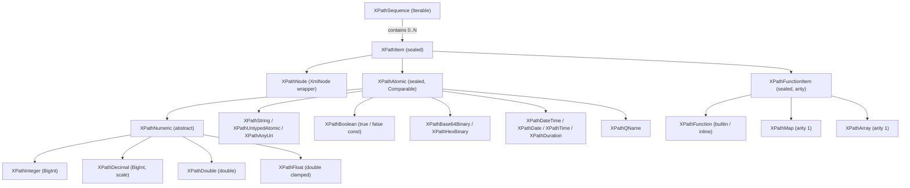

# XPath

Adhere to the official XPath 3.1 standard at all times:

- XML Path Language (XPath) 3.1: <https://www.w3.org/TR/xpath-31/>
- XPath Functions and Operators 3.1: <https://www.w3.org/TR/xpath-functions-31/>

The official QT3 test suite can be run with the command `dart run bin/xpath_qt3tests.dart`. Regressions in the QT3 test suite are not acceptable.

## Overall Design

The core goals of this design are **correctness with the standard**, **efficiency**, **compactness**, and **readability**. The engine is built directly upon the W3C XQuery and XPath Data Model 3.1 (XDM).

- **XDM 3.1 Data Model**: Everything in XPath evaluation is an `XPathSequence` containing zero or more `XPathItem`s.
- **Typed Atomics**: Exact schema type identity is preserved across all evaluation stages (`XPathAtomic`).
- **Arbitrary Precision**: `XPathInteger` is backed by `BigInt`, and `XPathDecimal` is backed by fixed-point unscaled integer and scale, eliminating IEEE-754 floating point drift for decimal operations.
- **W3C §19 Casting Matrix**: Explicit, zero-heuristic static casting table lookup and conversion.
- **Lazy & Flatted Sequences**: All sequences implement the XDM flattening invariant (`(1, (2, 3)) == (1, 2, 3)`).
- **First-Class Function Items**: Maps, arrays, and functions are unified under `XPathFunctionItem` (functions with arity).

## Data Model

The data model is rooted in `XPathItem`:

### Sequences (`XPathSequence`)

Sequences are ordered collections of zero or more `XPathItem` instances. Sequences cannot contain nested sequences; all nested sequences are automatically flattened.

| Constant / Factory | Description |
| --- | --- |
| `XPathSequence.empty` | Canonical empty sequence `()`. |
| `XPathSequence.trueSequence` | Sequence containing `XPathBoolean.trueInstance`. |
| `XPathSequence.falseSequence` | Sequence containing `XPathBoolean.falseInstance`. |
| `XPathSequence.single(item)` | Sequence containing exactly one item. |
| `XPathSequence.from(items)` | Sequence created from an iterable, flattening any sequences. |
| `XPathSequence.cached(items)` | Lazy sequence cached on first evaluation. |

### Nodes (`XPathNode`)

Represents XML DOM nodes wrapping `XmlNode`.

- Atomization yields `XPathUntypedAtomic` containing the string value of the node.
- Effective Boolean Value (EBV) of any node is always `true`.

### Functions, Maps, and Arrays (`XPathFunctionItem`)

In XPath 3.1, functions, maps, and arrays all implement `XPathFunctionItem`:

- `XPathFunction`: Builtin or inline anonymous functions with an associated arity.
- `XPathMap`: Associative map implementing a function of arity 1 (`$map($key)`).
- `XPathArray`: 1-based indexed collection implementing a function of arity 1 (`$array($index)`).
- Attempting to atomize a function item or map raises `err:FOTY0013`. Computing EBV raises `err:FORG0006`.

### Casting & Comparisons

- Casting is driven by the static 2D lookup table in `casting_matrix.dart` implementing the full W3C XPath 3.1 §19 matrix.
- Comparisons evaluate along typed domains via `XPathAtomic.compareTo`, promoting `xs:untypedAtomic` per W3C specification without heuristics.

## Functions & Operators

- **XPath Operators**: Implemented in `operators/`. Accept and return `XPathSequence`s, evaluating on native `XPathItem`s.
- **XPath Functions**: Implemented in `functions/`. Accept `XPathContext` and `List<XPathSequence>` arguments, returning an `XPathSequence`.
- **XPath Expressions**: Functional AST nodes implementing `call(XPathContext context) -> XPathSequence`.

## Error Handling

Standard XPath errors are defined using `XPathErrorCode` adhering to <https://www.w3.org/2005/xqt-errors/>.

- Evaluation failures must throw `XPathEvaluationException(XPathErrorCode errorCode, [String? details])`.
- Never hardcode error code strings like `[err:XPTY0004]` into error messages; `XPathErrorCode.format` automatically produces standard formatted descriptions with `[err:XXXX]`.
- QT3 verifier asserts against expected error codes using `XPathEvaluationException.errorCode`.
